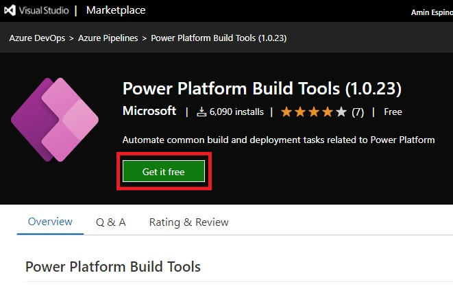
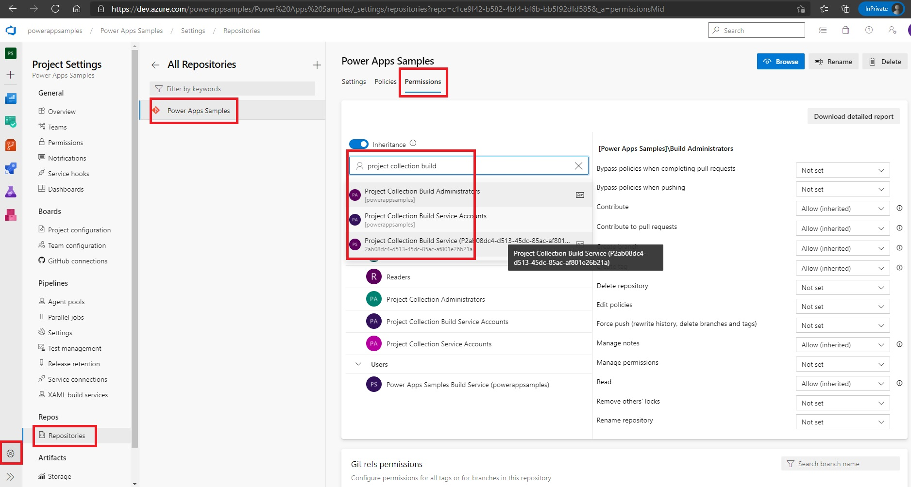
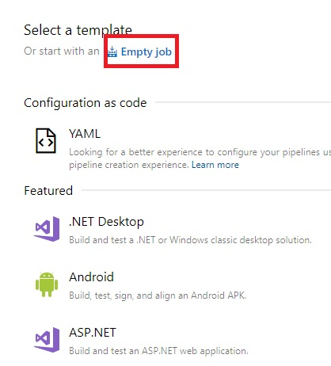
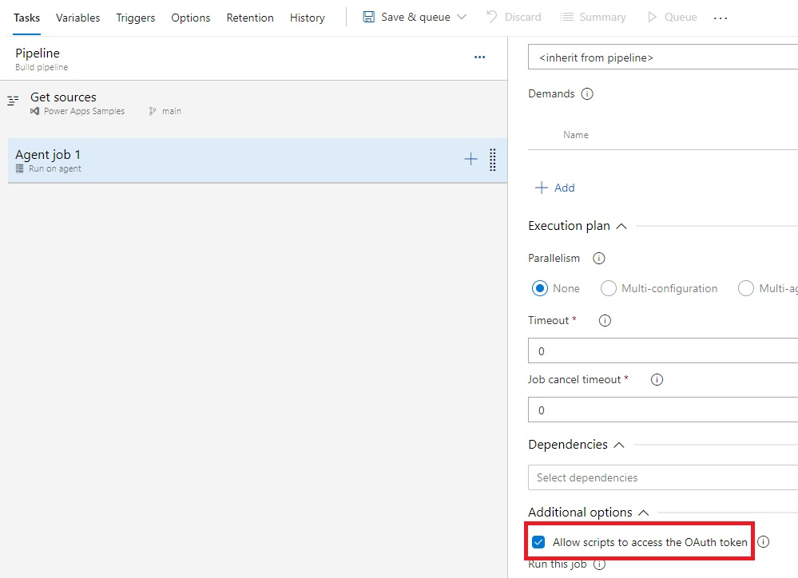
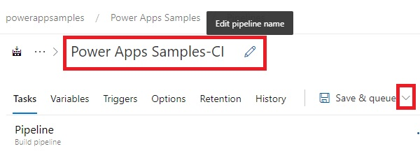
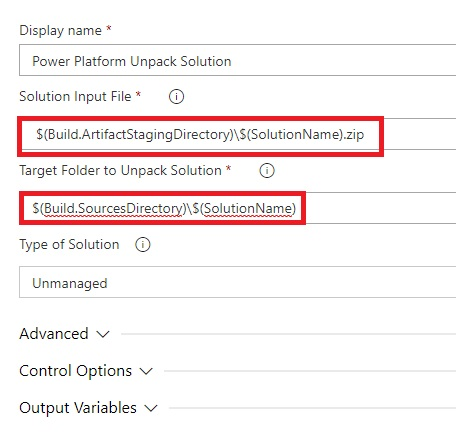
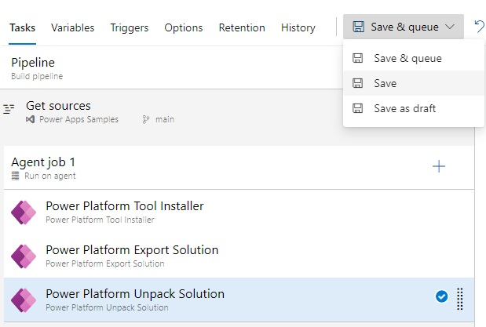
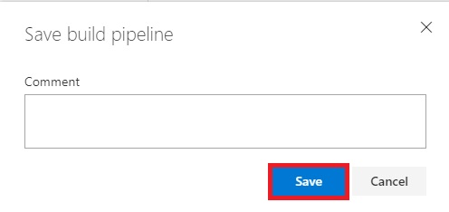
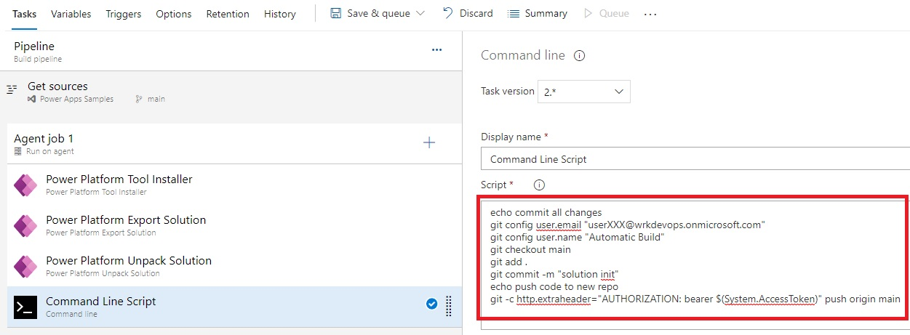
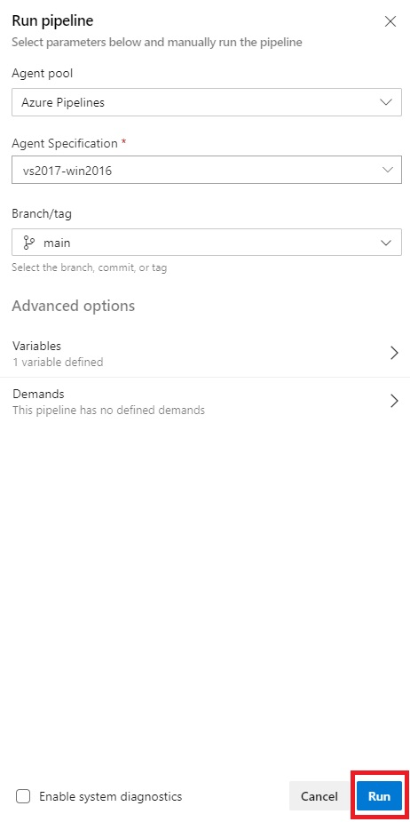

# Power Platform Build Tools Hands-on Lab
## Module 2: Automating Solution Deployment Using Azure DevOps
Last updated: February 15, 2021
Authors: Per Mikkelsen, Shan McArthur, Evan Chaki, Amin Espinoza

## Lab Scenario
In this hands-on lab, you will create an Azure DevOps Project, setup permissions and create the required pipelines to automatically export your app (as unmanaged solution) from a development environment, generate a build artifact (managed solution) and finally deply the app into production. The lab will also introduce you to Microsoft Power Platform Build Tools.

## Create an Azure DevOps Project
We are going to use Azure DevOps for both source code storage, build and deployment automation. You can use any automated source control and build automation tools using the same principles. Your configuration data should be exported from a development environment, processed by Package Deployer, and checked into source control.

1. Log into [dev.azure.com](https://dev.azure.com/) with your credentials and click on your organization in the left panel. Follow the instructions to create a project.


2. When the project is completed, you will need to create a Repo to hold the source code. Click on the **Repos** link in the left navigation.


3. Initialize the repo with the default README by clicking the **Initialize** button.


### Install and enable the Azure DevOps Extensions for Power Platform

4. On the upper right corner close to your profile icon, you can see a **bag icon**, click it and then select the option **Browse marketplace**.


5. This will redirect you to the Azure DevOps marketplace. Search for **Power Platform** and select the **Power Platform Build Tools**. Note that there are great community options too.


6. Click **Get it free**.



7. Click **Install**.


8. Click **Proceed to organization**.


### Configure Azure DevOps Permissions for Build Service Account

The build pipelines that we set up later will be exporting files from an org and checking them into your source code repo. This is not a default permission of Azure DevOps, so we need to configure the appropriate permissions for the pipeline to function properly.

9. Click the **Project Settings** icon on the lower left of the screen and click the **Repositories** link int the fly out menu. Select the repository in your project and go to the **Permissions** tab. Type in **Project Collection Build Service** and select it (select the project collection with the username appended).



10. The setting for the user is displayed. Select Allow for **Contribute** and ensure that the green checkbox is displayed.


### Build Pipeline 1: Create Export from Dev

The first pipeline you wil create will export your solution from your development environment as an unmanaged solution, unpack it and check it into source control (your repo).

11. Click the **Create Pipeline** button.


12. Click **use the classic editor** link to create a pipeline.


13. Leave default values as is and click **Continue**.


14. Select **Empty job** to create an empty job.



15. Select **Agent job 1** and enable the **Allow scripts to access the OAuth token** option.



16. Name the pipeline **Create Export from Dev** and click Save. Changes to your pipeline are also checked into source control so you will be prompted to select the folder and type a comment before saving.



17. You are now ready to start using the Power Platform Build Tools tasks for Azure DevOps in your pipeline. Select **Add a task to Agent job 1**.


18. The very first task you will create is a task that installs the required tools in the agent. Search for **Power Platform Tool**


19. Select **Add** under the Power Platform Tool Installer task.


20. This will add the Tool Installer task to the Pipeline. No additional configuration is required for this task.


### Export Solution as Unmanaged

Your unmanaged solution is your source code for your configuration. You should export your solution as unmanaged to check it into source control. 

21. The next task you will add is a task that exports the unmanaged solution from development environment. Search for **Power Platform Export Solution**.


22. Select the task and click **Add**.


23. After adding the Power Platform Export Solution task, you will notice that additional configuration is required. Click on the Power Platform Export Solution (in the pipeline view).


24. This will open the task configuration page:

* **Display name**: Is inherited from Build task itself.
* **Application type**: Two types of authentications are available:
    * **Username/password**: Simple to setup but does not support multi factor authentication (MFA). This is what we will use for this lab.
    * **Service Principal/client secret**: Recommended and supports MFA. This is harder to setup as it requires creation of the Service principal and client secret in the Azure Portal as well as creation of the application user in the Power Platform environment. Not used in this lab but anyone familiar with setting this up can use this option instead throughout the rest of the lab.
* **Service Connection**: This is the connection to the environment that you want to export the solution from. We will define this in the next step.
* **Solution name**: This is the mane of the solution you want to export.
* **Solution output file**: This specifies the path and filename of the generated solution zip.
* **Export as Managed solution**: By default, solutions are exported as unmanaged (for development purposes). Setting this flag exports the solution as Managed (used fro deployment to any downstream environment such as Test, Pre-prod, and Production).

25. Select **Username/password** under **Authentication type**. Click on **Manage** next to Service connection.


26. This will bring up the connection configuration required to export the solution from the development environment (user-xx-dev). Click **Create service connection**.


27. This will bring up the New Service connection screen. Select **Generic** from the list of connections and click **Next**.


28. Fill the required details:

    * **Server URL**: https://<environment-url>.crm.dynamics.com. This should be the URL to your development environment.
    * **Username**: Username of a user with admin access to the environment.
    * **Password**: Associated password for the user.
    * **Service Connection Name**: This name will be used to identify which environment to connect to the Build tasks.
    * **Description**: Give the connection a description that helps you identify the environment the service connection connects to.

A sample connection is shown below.


29. Click **Save**. You will be in the pipeline service connection area in your project.
30. Close the browser tab and go back to the previous tab where tou were building the pipeline. Select the Service Connection that created in the previous step.


31. Fill out the remaining details:
    * Solution Name: **$(SolutionName)
      **Note**: This will use the input parameter that you specify when running (queuing) the build pipeline.
    * Solution Output File: **$(Build.ArtifactStagingDirectory)\$(SolutionName).zip**
      **Note** This will add the file to your repo and retain the existing solution name.


32. Save the Build Pipeline by clicking **Save & Queue**, then save from the top command bar and clicking **Save** on the dialog.

### Unpack Solution

The solution file that is exported from the server is a zip file with consolidated configuration files. These initial files are not suitable for source code management as they are not structured to make it feasible for source code management systems to properly do differencing on the files and capture the changes you want to commit to source control. You need to **unpack** the solution files to make then suitable for source control storage and processing.

33. Click **Ad a task**, then search for **Power Platform Unpack**.


34. Add the Power Platform Unpack Solution task to the pipeline.


35. Open the task to configure settings for the task with the following details:

* **Solution Input File**: $(Build.ArtifactStagingDirectory)\$(SolutionName).zip
* **Target folder to unpack solution**: $(Build.SourcesDirectory)\$(SolutionName)
* **Type of sulution**: Unmanaged.



36. Save the updated pipeline.



37. You can leave the comment blank.



### Commit Solution Files to Source Control

Next, we are going to add some scripts as a next pipeline step to commit the solution to the repo. The reason we allowed for scripts to access the OAuth token when we started building the pipeline was to allow for this next step.

38. Add a Command Line task to your pipeline by clicking the **+** button, searching for **command**, and adding it.


39. Select the task, give the task a display name and copy the following script into the script textbox:

```bash
echo commit all changes
git config user.email "userXXX@wrkdevops.onmicrosoft.com"
git config user.name "Automatic Build"
git checkout master
git add --all
git commit -m "solution init"
echo push code to new repo
git -c http.extraheader="AUTHORIZATION: bearer $(System.AccessToken)" push origin main
```

40. Screenshot provided below:



41. Save the task (Save & queue > Save).

### Test your Pipeline

42. Select **Queue** to execute your pipeline.


43. Leave the defaults and click **Run**.



44. You can see your build has been queued. You can navigate to it directly in the notification on this screen or using the **Builds** area in the left navigation.


45. The desired outcome would be a series of green checkboxes, but if you have some issues with your pipeline, you should see the errors in the log. You can click on those for more details if you like. In our case, we have not defined our solution name variable yet, so the export step will fail. This was done intentionally to show you what a failure looks like and how to look at the details.


46. Go back to your pipeline by selecting the arrow next to the pipeline name on the top of the screen.


47. Select the three dots button and then **Edit pipeline**.


48. On the pipelines screen, switch to the Variables tab and click **Add** to add a new variable.

49. Use **SolutionName** for the name of the variable and add your unique solution name as a value. It should be your solution's name form Module1 (point 3).


50. Click **Save and queue** and observe the results. Fix any issues until you get a successful build.

