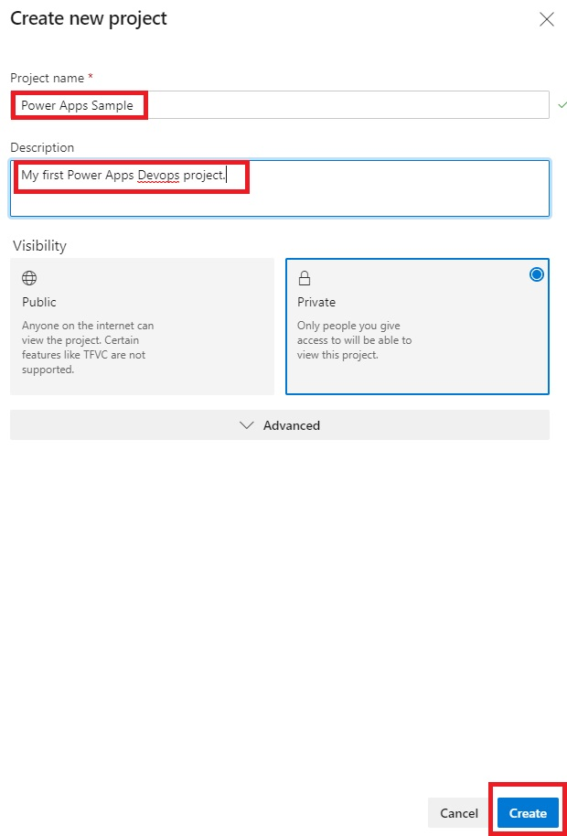
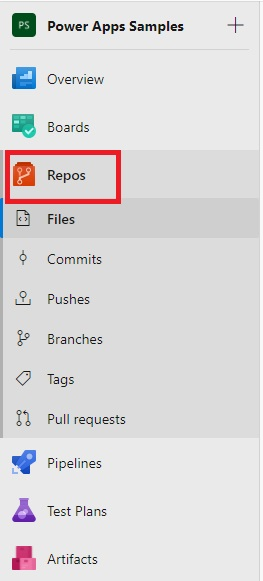
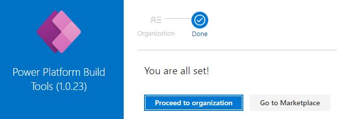
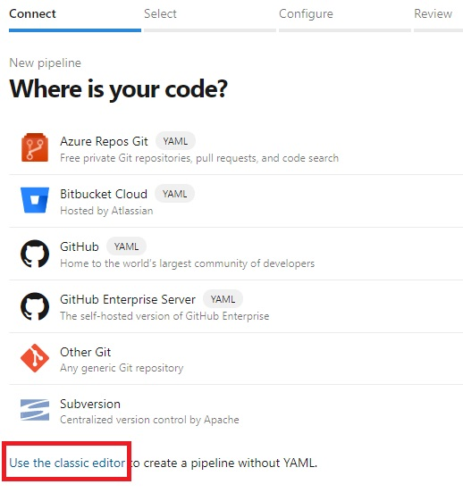

# Power Platform Build Tools Hands-on Lab
## Module 2: Automating Solution Deployment Using Azure DevOps
Last updated: February 15, 2021
Authors: Per Mikkelsen, Shan McArthur, Evan Chaki, Amin Espinoza

## Lab Scenario
In this hands-on lab, you will create an Azure DevOps Project, setup permissions and create the required pipelines to automatically export your app (as unmanaged solution) from a development environment, generate a build artifact (managed solution) and finally deply the app into production. The lab will also introduce you to Microsoft Power Platform Build Tools.

## Create an Azure DevOps Project
We are going to use Azure DevOps for both source code storage, build and deployment automation. You can use any automated source control and build automation tools using the same principles. Your configuration data should be exported from a development environment, processed by Package Deployer, and checked into source control.

1. Log into [dev.azure.com](https://dev.azure.com/) with your credentials and click on your organization in the left panel. Follow the instructions to create a project.

2. When the project is completed, you will need to create a Repo to hold the source code. Click on the **Repos** link in the left navigation.

3. Initialize the repo with the default README by clicking the **Initialize** button.

### Install and enable the Azure DevOps Extensions for Power Platform

4. On the upper right corner close to your profile icon, you can see a **bag icon**, click it and then select the option **Browse marketplace**.

5. This will redirect you to the Azure DevOps marketplace. Search for **Power Platform** and select the **Power Platform Build Tools**. Note that there are great community options too.

6. Click **Get it free**.

7. Click **Install**.

8. Click **Proceed to organization**.

### Configure Azure DevOps Permissions for Build Service Account

The build pipelines that we set up later will be exporting files from an org and checking them into your source code repo. This is not a default permission of Azure DevOps, so we need to configure the appropriate permissions for the pipeline to function properly.

9. Click the **Project Settings** icon on the lower left of the screen and click the **Repositories** link int the fly out menu. Select the repository in your project and go to the **Permissions** tab. Type in **Project Collection Build Service** and select it (select the project collection with the username appended).

10. The setting for the user is displayed. Select Allow for **Contribute** and ensure that the green checkbox is displayed.

### Build Pipeline 1: Create Export from Dev

The first pipeline you wil create will export your solution from your development environment as an unmanaged solution, unpack it and check it into source control (your repo).

11. Click the **Create Pipeline** button.

12. Click **use the classic editor** link to create a pipeline.

13. Leave default values as is and click **Continue**.

14. Select **Empty job** to create an empty job.

15. Select **Agent job 1** and enable the **Allow scripts to access the OAuth token** option.

16. Name the pipeline **Create Export from Dev** and click Save. Changes to your pipeline are also checked into source control so you will be prompted to select the folder and type a comment before saving.

17. You are now ready to start using the Power Platform Build Tools tasks for Azure DevOps in your pipeline. Select **Add a task to Agent job 1**.

18. The very first task you will create is a task that installs the required tools in the agent. Search for **Power Platform Tool**

19. Select **Add** under the Power Platform Tool Installer task.

